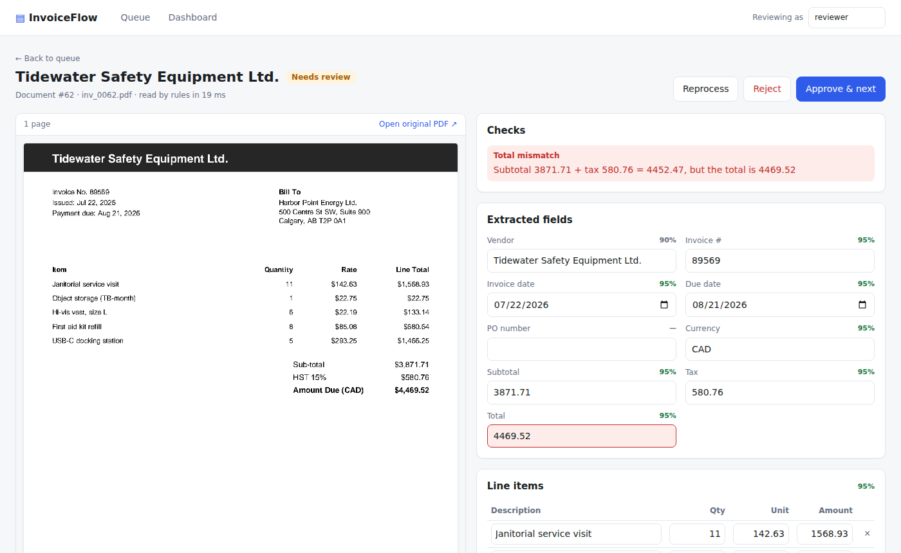
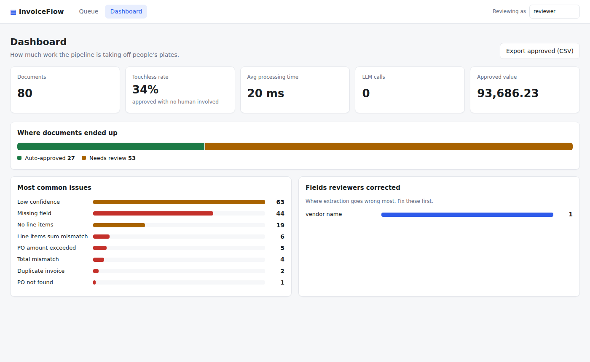

# InvoiceFlow

Automated invoice processing: PDFs come in, fields get extracted (regex first, an LLM when needed), business rules catch bad invoices, and only the ones that need a person reach the review queue. Everything is measured by an evaluation harness that runs in CI.




## What it does

- **Reads invoices** from uploads or a watched folder: vendor, invoice number, dates, PO, currency, subtotal, tax, total and line items.
- **Hybrid extraction.** A free regex extractor handles known layouts in ~20 ms. When it isn't confident, an LLM (Claude or Gemini) reads the document, and the two readings are cross-checked field by field.
- **Catches problems before anyone pays:** totals that don't add up, line items that don't match the subtotal, unusual tax rates, duplicate invoices (even re-sent as a different file), unknown POs, POs billed past their amount.
- **Routes automatically.** Clean, confidently-read invoices are approved with no human involved. Everything else goes to a review screen with the PDF next to the extracted fields.
- **Keeps an audit trail** of every correction and decision. Overriding an error requires a written reason.
- **Is safe to run for real:** idempotent ingest (SHA-256), retries with a failure state, several workers in parallel without double-processing (Postgres `SKIP LOCKED`), money stored as integer cents.
- **Measures itself.** The eval harness scores field accuracy, error detection and, most importantly, how often an auto-approved invoice was actually correct. CI fails if any of these drop.

## Results

On 80 generated invoices across 4 layouts, with 22 planted errors. One layout is **held out**: the regex extractor was never written against it, so it measures how each approach handles a vendor it hasn't seen.

| Extractor | Field accuracy | Held-out layout | Errors caught | Touchless | Auto-approved & correct | LLM calls / doc |
|---|---|---|---|---|---|---|
| Rules (regex) | 82.4% | 25.7% | 18/22 | 33.8% | 96.3% | 0 |
| Hybrid (rules → Groq gpt-oss-120b) | 98.8% | 94.7% | 22/22 | 71.2% | 100.0% | 0.525 |
| LLM only (Claude Haiku) | _run it_ | _run it_ | _run it_ | _run it_ | _run it_ | 1.0 |

Fill in the LLM rows by running `python -m evals.run_eval --extractor hybrid` (needs an API key). Full reports are written to `evals/reports/`.

**What the baseline shows:** regex is perfect on the three layouts it was written for and falls apart on a new one. That gap is the case for the LLM. The eval also caught a subtle failure: a duplicate invoice was auto-approved because its original (in the unseen layout) had been misread, so there was nothing correct to match against. The fix is that correcting a document re-checks other documents from the same vendor, which pulls the duplicate back into review (`tests/test_api.py::test_fixing_an_original_reopens_its_auto_approved_duplicate`).

## Quick start

Needs Python 3.11+ and Node 20+.

```bash
python -m venv .venv && source .venv/bin/activate      # Windows: .venv\Scripts\activate
pip install -r requirements-dev.txt
cp .env.example .env

python -m data.generate_invoices          # 80 labeled sample invoices -> data/synthetic/
pytest                                    # 56 tests (1 runs only on Postgres)
python -m app.cli demo                    # load POs, ingest and process the samples

cd web && npm install && npm run build && cd ..
flask --app wsgi run --port 5001          # http://localhost:5001
```

For UI development with hot reload, run `flask --app wsgi run --port 5001` in one terminal and `cd web && npm run dev` in another, then open http://localhost:5173.

### With Docker (Postgres + API + worker)

```bash
cp .env.example .env
docker compose up --build                 # http://localhost:8000
```

Drop PDFs into `./inbox` and the worker picks them up. Deploying to AWS: [docs/deploy-aws.md](docs/deploy-aws.md).

## Using an LLM

```bash
# in .env
EXTRACTOR=hybrid                  # or "llm" to use it on every document
LLM_PROVIDER=anthropic            # or "groq" / "gemini" (free tiers), or "openai_compatible" (OpenRouter, local Ollama)
ANTHROPIC_API_KEY=sk-ant-...
```

On a free tier, also set `LLM_MIN_INTERVAL_SECONDS=6` to stay under the requests-per-minute limit. Rate-limit and temporary server errors are retried automatically with exponential backoff; errors that retrying can't fix (like a bad key) fail straight away.

The model answers through a forced tool call with a JSON schema, and the answer is validated with Pydantic, so malformed output fails loudly and is retried instead of being saved. Scanned PDFs with no text layer are sent to the model as a PDF.

**Confidence is not the model rating itself** (LLMs are poorly calibrated about their own certainty). A field is trusted when the LLM and the regex reading agree, or when the regex found nothing solid and the numbers add up. When a confident regex reading disagrees with the LLM, a human decides.

## Evaluation

```bash
python -m evals.run_eval --extractor rules
python -m evals.run_eval --extractor hybrid --min-field-accuracy 0.95 --min-auto-approved-precision 0.99
```

| Metric | Meaning |
|---|---|
| Field accuracy | Share of fields read exactly right (normalized for case, spacing, number format) |
| Documents fully correct | Every header field and every line item right |
| Errors caught | Planted problems (duplicates, PO overruns, total mismatches...) that validation flagged |
| False alarms | Business-rule errors raised on documents that didn't have them |
| Touchless | Share of documents approved with no human involved |
| **Auto-approved & correct** | Of the touchless documents, how many were actually right. The number that matters most: a wrong auto-approval means paying a wrong invoice |

The `--min-*` flags make the command exit with an error, which is how CI blocks a change that makes extraction worse. Reviewed documents can be exported as new test cases (`python -m evals.export_reviewed`), so the eval grows with real documents over time.

## API

| Method | Path | Purpose |
|---|---|---|
| `POST` | `/api/documents` | Upload PDFs (multipart field `files`). Re-uploading the same file returns the existing document |
| `GET` | `/api/documents?status=&q=&page=` | List and search |
| `GET` | `/api/documents/{id}` | Full detail: fields, confidence, issues, audit trail |
| `GET` | `/api/documents/{id}/file` | Original PDF |
| `GET` | `/api/documents/{id}/pages/{n}.png` | Rendered page image |
| `PUT` | `/api/documents/{id}/invoice` | Save corrections (audited, re-validated) |
| `POST` | `/api/documents/{id}/approve` | Approve (`{"override": true, "note": "..."}` if errors remain) |
| `POST` | `/api/documents/{id}/reject` | Reject (note required) |
| `POST` | `/api/documents/{id}/reprocess` | Run extraction again |
| `GET` | `/api/stats` | Dashboard numbers |
| `GET` | `/api/export.csv` | Approved invoices for an accounting system |
| `GET`/`POST` | `/api/purchase-orders` | List or upsert POs |
| `GET` | `/api/health` | Health check |

Finance reporting views (vendor spend, PO utilization, review-queue aging, upcoming payments, weekly automation rate) are in [`sql/reports.sql`](sql/reports.sql).

## Project structure

```
app/
  extraction/        rules.py (regex), llm.py (Claude/Gemini), __init__.py (hybrid), parsing.py
  validation.py      business rules + duplicate and PO checks
  processor.py       ingest -> extract -> validate -> route, retries, job claiming
  worker.py          background worker (+ watched folder)
  api.py             REST API
  models.py          SQLAlchemy tables
data/generate_invoices.py   labeled synthetic dataset with planted errors
evals/               run_eval.py (harness + CI gate), export_reviewed.py
web/                 React + TypeScript review UI
tests/               pytest suite (runs on SQLite and Postgres)
sql/reports.sql      reporting views
deploy/              Caddy (HTTPS), production compose, IAM policy, backups
docs/                architecture.md, deploy-aws.md
```

More detail on the design: [docs/architecture.md](docs/architecture.md).


