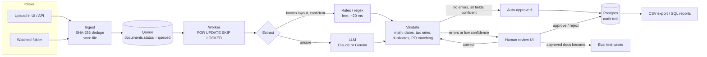

# Architecture

## Request flow

1. **Ingest** (`app/processor.py: ingest_bytes`). The file is hashed (SHA-256). If that hash already exists, nothing happens and the existing document is returned, which makes uploads idempotent. Otherwise the PDF goes to storage (a local folder or S3) and a `documents` row is created with status `queued`.
2. **Claim** (`claim_next`). A worker selects the oldest queued row with `FOR UPDATE SKIP LOCKED`. Other workers skip locked rows instead of waiting, so any number of workers can drain the queue in parallel without double-processing (`tests/test_pipeline.py::test_parallel_workers_never_process_a_document_twice`).
3. **Extract** (`app/extraction/`). In hybrid mode the regex extractor runs first. If every required field is present and confident and the numbers add up, the result is used as-is, with no API call. Otherwise the LLM reads the document, and each field's confidence comes from agreement with the regex reading and from whether the math checks out.
4. **Validate** (`app/validation.py`). Pure checks: required fields, line items sum to subtotal, subtotal + tax = total, tax rate is a real Canadian rate, date sanity. Database checks: duplicate invoices (same vendor + number, even if the file differs) and purchase-order matching (PO exists, same vendor, open, running total within the PO amount).
5. **Route** (`route`). Any `error` issue or low-confidence field sends the document to review. Otherwise it's auto-approved.
6. **Review** (`app/api.py`, `web/`). A person sees the PDF next to the extracted fields. Each correction is saved as a `review_events` row (who, what, old → new), and validation re-runs. Approving with unresolved errors requires an override note. Correcting a document also re-checks other documents from the same vendor, which catches duplicates whose original had been misread.
7. **Failure handling**. Any exception while processing is recorded on the document (`last_error`). It goes back to the queue until `MAX_ATTEMPTS`, then becomes `failed` and is visible in the UI. A crashed worker's in-flight document is re-queued after 10 minutes (`requeue_stuck`).

## Data model

| Table | Purpose |
|---|---|
| `documents` | One row per unique file: status, attempts, errors, timing, LLM calls |
| `invoices` | Extracted header fields (money in integer cents) + per-field confidence + the raw machine output |
| `line_items` | Invoice lines |
| `validation_issues` | Current issues for a document (replaced on every re-validation) |
| `review_events` | Append-only audit trail of human actions |
| `purchase_orders` | POs to match invoices against |

## Why these choices

- **Integer cents**, not floats: `0.1 + 0.2 != 0.3` in floating point, and a rounding bug in an accounts-payable system means paying the wrong amount.
- **Raw extraction kept separately** from corrected values: evals measure what the machine read, and the dashboard can show which fields reviewers fix most.
- **Confidence from agreement, not self-rating**: LLMs are poorly calibrated about their own certainty. Two independent readers agreeing, plus arithmetic that checks out, is much stronger evidence.
- **A held-out layout in the eval**: the regex extractor scores 100% on the layouts it was written for, which says nothing about new vendors. The held-out layout measures generalization honestly.
- **Postgres in production, SQLite for local dev and tests**: the same code runs on both (CI runs the suite on each). `SKIP LOCKED` only matters on Postgres.
